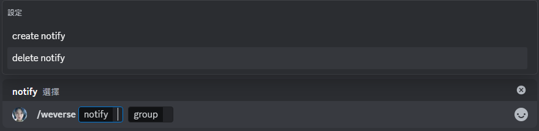
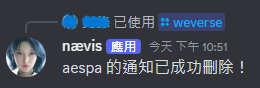

 🌐Translated by AI 

## 📚 Table of Contents  
1. [✨ Introduction](https://github.com/craz1gre0/weverse-notify-bot/blob/main/README.md#-簡介)  
2. [🛠️ How to Use](https://github.com/craz1gre0/weverse-notify-bot/blob/main/README.md#%EF%B8%8F-使用方法)  
   - [📎 Invite the Bot](https://github.com/craz1gre0/weverse-notify-bot/blob/main/README.md#-邀請機器人)
   - [📝 Create Notifications](https://github.com/craz1gre0/weverse-notify-bot/blob/main/README.md#-創建通知)  
   - [🗑️ Delete Notifications](https://github.com/craz1gre0/weverse-notify-bot/blob/main/README.md#%EF%B8%8F-刪除通知)  
   - [🔍 View Your Notifications (Notification List)](https://github.com/craz1gre0/weverse-notify-bot/blob/main/README.md#-查看你有哪些通知通知列表)
   - [🔄 Reset All Notifications](https://github.com/craz1gre0/weverse-notify-bot/blob/main/README.md#-重置你的所有通知)
   - [📶 Check Connection Status](https://github.com/craz1gre0/weverse-notify-bot/blob/main/README.md#-查看連線狀態)
   - [💬 Feedback and Suggestions](https://github.com/craz1gre0/weverse-notify-bot/blob/main/README.md#-給我建議與回饋)
3. [📜 Terms of Service](https://github.com/craz1gre0/weverse-notify-bot/blob/main/README.md#-服務條款)  
4. [⚠️ Disclaimer](https://github.com/craz1gre0/weverse-notify-bot/blob/main/README.md#%EF%B8%8F-免責聲明)

## ✨ Introduction

This is a Discord bot that provides post notifications for Weverse.

We support all languages as the bot translates messages based on your language settings.  
 [Invite the Bot](https://discord.com/oauth2/authorize?client_id=1314971413769359370&permissions=2147863616&integration_type=0&scope=bot)  
  [🔠Back to Table of Contents](https://github.com/craz1gre0/weverse-notify-bot/blob/main/README.md#-%E7%9B%AE%E9%8C%84)

## 🛠️ How to Use

### 📎 Invite the Bot

⚠️ **Note: You must ensure the bot is in your server to use it.**  

Required permissions for the bot:  
> Add Reactions  
> Attach Files  
> Embed Links  
> Read Message History  
> Send Messages  
> Use External Emojis  
> Use Slash Commands  
> View Channels  

[Invite the Bot](https://discord.com/oauth2/authorize?client_id=1314971413769359370&permissions=2147863616&integration_type=0&scope=bot)  

Alternatively, you can use the `/invite` command to get the bot invitation link.  
  [🔠Back to Table of Contents](https://github.com/craz1gre0/weverse-notify-bot/blob/main/README.md#-%E7%9B%AE%E9%8C%84)

### 📝 Create Notifications

⚠️ **Note: You must have admin permissions in the server to use this command.**

1. Type `/weverse` in the message bar.

2. Choose "create notify" from the `notify` option.

3. Select the group you want to create a notification for in the `group` option.

4. Success message will appear.

  
  [🔠Back to Table of Contents](https://github.com/craz1gre0/weverse-notify-bot/blob/main/README.md#-%E7%9B%AE%E9%8C%84)

### 🗑️ Delete Notifications

⚠️ **Note: You must have admin permissions in the server to use this command.**

1. Type `/weverse` in the message bar.

2. Choose "delete notify" from the `notify` option.

3. Select the group you want to delete notifications for in the `group` option.

4. Success message will appear.

  
  [🔠Back to Table of Contents](https://github.com/craz1gre0/weverse-notify-bot/blob/main/README.md#-%E7%9B%AE%E9%8C%84)

### 🔍 View Your Notifications (Notification List)

Type `/notify_list` in the message bar.  
  [🔠Back to Table of Contents](https://github.com/craz1gre0/weverse-notify-bot/blob/main/README.md#-%E7%9B%AE%E9%8C%84)

### 🔄 Reset All Notifications

⚠️ **Note: You must have admin permissions in the server to use this command.**  
⚠️ **Note: This will immediately delete all notifications in your server.**

Type `/notify_reset` in the message bar.  
  [🔠Back to Table of Contents](https://github.com/craz1gre0/weverse-notify-bot/blob/main/README.md#-%E7%9B%AE%E9%8C%84)

### 📶 Check Connection Status

Type `/ping` in the message bar.  
  [🔠Back to Table of Contents](https://github.com/craz1gre0/weverse-notify-bot/blob/main/README.md#-%E7%9B%AE%E9%8C%84)

### 💬 Feedback and Suggestions

Type `/feedback [Your Feedback and Suggestions]` in the message bar.

  
  [🔠Back to Table of Contents](https://github.com/craz1gre0/weverse-notify-bot/blob/main/README.md#-%E7%9B%AE%E9%8C%84)

## 📜 Terms of Service

- This bot follows the [Discord Developer Terms of Service](https://discord.com/developers/docs/policies-and-agreements/developer-terms-of-service).  
- We provide notifications for Weverse posts.  
- The bot only accesses server IDs, text channel IDs, and your language preferences. These are necessary for sending messages and translating content.  
- You should never spam commands or abuse the bot. Report any bugs to the bot owner.  
- If you abuse, spam, or engage in disruptive behavior with this bot or other bots, you will be blocked.  
- You may suggest features to be added to the bot.  
- Thank you for using the bot.  

For any questions, feel free to contact us at steven951109@gmail.com.  
  [🔠Back to Table of Contents](https://github.com/craz1gre0/weverse-notify-bot/blob/main/README.md#-%E7%9B%AE%E9%8C%84)

## ⚠️ Disclaimer

1. **Unofficial Project**  
   This bot is a personal project and is not affiliated with, endorsed, or approved by Weverse, SM Entertainment, or its parent companies.  

2. **Liability**  
   - This bot provides Weverse post notifications based on publicly accessible information.  
   - We strive for accuracy and timeliness but cannot guarantee uninterrupted or error-free service.  
   - The developer is not responsible for any issues, disputes, or losses caused by using this bot.  

3. **Usage Terms**  
   - This bot is for personal use only and must not be used for commercial purposes.  
   - Users must comply with Weverse’s terms of service and bear responsibility for their actions.  

4. **Copyright and Trademarks**  
   - Weverse, SM, and their associated trademarks, logos, and content are the property of HYBE Corporation. This bot does not claim ownership of or intend to infringe upon these rights.  

By using this bot, you agree to the above terms and understand the associated risks.  
  [🔠Back to Table of Contents](https://github.com/craz1gre0/weverse-notify-bot/blob/main/README.md#-%E7%9B%AE%E9%8C%84)
