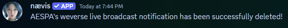

 🌐Translated by AI 

## 📚 Table of Contents  
1. [✨ Introduction](https://github.com/craz1gre0/weverse-notify-bot/blob/main/README-EN.md#-introduction)  
2. [🛠️ How to Use](https://github.com/craz1gre0/weverse-notify-bot/blob/main/README-EN.md#%EF%B8%8F-how-to-use)  
   - [📎 Invite the Bot](https://github.com/craz1gre0/weverse-notify-bot/blob/main/README-EN.md#-invite-the-bot)
   - [📝 Create Weverse Post Notifications](https://github.com/craz1gre0/weverse-notify-bot/blob/main/README-EN.md#-create-weverse-post-notifications)  
   - [🗑️ Delete Weverse Post Notifications](https://github.com/craz1gre0/weverse-notify-bot/blob/main/README-EN.md#%EF%B8%8F-delete-weverse-post-notifications)
   - [🖥️ Create Weverse Live Notifications](https://github.com/craz1gre0/weverse-notify-bot/blob/main/README-EN.md#%EF%B8%8F-create-weverse-live-notifications)
   - [🗑️ Delete Weverse Live Notifications](https://github.com/craz1gre0/weverse-notify-bot/blob/main/README-EN.md#%EF%B8%8F-delete-weverse-live-notifications)
   - [📄 Create IG Notifications](https://github.com/craz1gre0/weverse-notify-bot/blob/main/README-EN.md#-create-ig-notifications)
   - [🗑️ Delete IG Notifications](https://github.com/craz1gre0/weverse-notify-bot/blob/main/README-EN.md#%EF%B8%8F-delete-ig-notifications)
   - [🔍 View Your Notifications (Notification List)](https://github.com/craz1gre0/weverse-notify-bot/blob/main/README-EN.md#-view-your-notifications-notification-list)
   - [🔄 Reset All Notifications](https://github.com/craz1gre0/weverse-notify-bot/blob/main/README-EN.md#-reset-all-notifications)
   - [📶 Check Connection Status](https://github.com/craz1gre0/weverse-notify-bot/blob/main/README-EN.md#-check-connection-status)
   - [💬 Feedback and Suggestions](https://github.com/craz1gre0/weverse-notify-bot/blob/main/README-EN.md#-feedback-and-suggestions)
3. [📜 Terms of Service](https://github.com/craz1gre0/weverse-notify-bot/blob/main/README-EN.md#-terms-of-service)  
4. [⚠️ Disclaimer](https://github.com/craz1gre0/weverse-notify-bot/blob/main/README-EN.md#%EF%B8%8F-disclaimer)

## ✨ Introduction

This is a Discord bot that provides notifications for Weverse posts and live broadcasts, as well as notifications for individual Instagram updates of the aespa members.

We support all languages as the bot translates messages based on your language settings.  
 [Invite the Bot](https://discord.com/oauth2/authorize?client_id=1314971413769359370&permissions=2147863616&integration_type=0&scope=bot)  

[My discord server](https://discord.gg/tM9XuzPNSd)
  [🔠Back to Table of Contents](https://github.com/craz1gre0/weverse-notify-bot/blob/main/README-EN.md#-table-of-contents)

## 🛠️ How to Use

### 📎 Invite the Bot

⚠️ **Note: You must ensure the bot is in your server to use it.**  

Required permissions for the bot:  
> Add Reactions  
> Attach Files  
> Embed Links  
> Read Message History  
> Send Messages  
> Use External Emojis  
> Use Slash Commands  
> View Channels  

[Invite the Bot](https://discord.com/oauth2/authorize?client_id=1314971413769359370&permissions=2147863616&integration_type=0&scope=bot)  

Alternatively, you can use the `/invite` command to get the bot invitation link.  
  [🔠Back to Table of Contents](https://github.com/craz1gre0/weverse-notify-bot/blob/main/README-EN.md#-table-of-contents)

### 📝 Create Weverse Post Notifications  
  

⚠️ **Note: You must have server administrator permissions to access this command.**  

1. Type `/weverse notify` in the message bar.  

  

2. Select `Post Notify Create` in the notify option.  

  

3. Choose the group for which you want to add notifications.  

  

4. Successfully created.  

  
  [🔠Back to Table of Contents](https://github.com/craz1gre0/weverse-notify-bot/blob/main/README-EN.md#-table-of-contents)  

---

### 🗑️ Delete Weverse Post Notifications  
  

⚠️ **Note: You must have server administrator permissions to access this command.**  

1. Type `/weverse notify` in the message bar.  

  

2. Select `Post Notify Delete` in the notify option.  

  

3. Choose the group for which you want to delete notifications.  

  

4. Successfully deleted.  

  
  [🔠Back to Table of Contents](https://github.com/craz1gre0/weverse-notify-bot/blob/main/README-EN.md#-table-of-contents)  

---

### 🖥️ Create Weverse Live Notifications  
  

⚠️ **Note: You must have server administrator permissions to access this command.**  

1. Type `/weverse notify` in the message bar.  

  

2. Select `Live Notify Create` in the notify option.  

  

3. Choose the group for which you want to add live notifications.  

  

4. Successfully created.  

  
  [🔠Back to Table of Contents](https://github.com/craz1gre0/weverse-notify-bot/blob/main/README-EN.md#-table-of-contents)  

---

### 🗑️ Delete Weverse Live Notifications  
  

⚠️ **Note: You must have server administrator permissions to access this command.**  

1. Type `/weverse notify` in the message bar.  

  

2. Select `Live Notify Delete` in the notify option.  

  

3. Choose the group for which you want to delete live notifications.  

  

4. Successfully deleted.  

  
  [🔠Back to Table of Contents](https://github.com/craz1gre0/weverse-notify-bot/blob/main/README-EN.md#-table-of-contents)  

---

### 📄 Create IG Notifications  
  

⚠️ **Note: You must have server administrator permissions to access this command.**  

1. Type `/ig notify` in the message bar.  

  

2. Select `Notify Create` in the notify option.  

  

3. Choose the member for whom you want to create notifications.  

  

4. Successfully created.  

  
  [🔠Back to Table of Contents](https://github.com/craz1gre0/weverse-notify-bot/blob/main/README-EN.md#-table-of-contents)  

---

### 🗑️ Delete IG Notifications  
  

⚠️ **Note: You must have server administrator permissions to access this command.**  

1. Type `/ig notify` in the message bar.  

  

2. Select `Notify Delete` in the notify option.  

  

3. Choose the member for whom you want to delete notifications.  

  

4. Successfully deleted.  

  
  [🔠Back to Table of Contents](https://github.com/craz1gre0/weverse-notify-bot/blob/main/README-EN.md#-table-of-contents)

### 🔍 View Your Notifications (Notification List)

Type `/notify list` in the message bar.  
  [🔠Back to Table of Contents](https://github.com/craz1gre0/weverse-notify-bot/blob/main/README-EN.md#-table-of-contents)

### 🔄 Reset All Notifications

⚠️ **Note: You must have admin permissions in the server to use this command.**  
⚠️ **Note: This will immediately delete all notifications in your server.**

Type `/notify reset` in the message bar.  
  [🔠Back to Table of Contents](https://github.com/craz1gre0/weverse-notify-bot/blob/main/README-EN.md#-table-of-contents)

### 📶 Check Connection Status

Type `/ping` in the message bar.  
  [🔠Back to Table of Contents](https://github.com/craz1gre0/weverse-notify-bot/blob/main/README-EN.md#-table-of-contents)

### 💬 Feedback and Suggestions

Type `/feedback [Your Feedback and Suggestions]` in the message bar.

⚠️ **Note: If you have any questions, please use this command directly and I will DM you**

  
  [🔠Back to Table of Contents](https://github.com/craz1gre0/weverse-notify-bot/blob/main/README-EN.md#-table-of-contents)

## 📜 Terms of Service

- This bot follows the [Discord Developer Terms of Service](https://discord.com/developers/docs/policies-and-agreements/developer-terms-of-service).  
- We provide notifications for Weverse posts.  
- The bot only accesses server IDs, text channel IDs, and your language preferences. These are necessary for sending messages and translating content.  
- You should never spam commands or abuse the bot. Report any bugs to the bot owner.  
- If you abuse, spam, or engage in disruptive behavior with this bot or other bots, you will be blocked.  
- You may suggest features to be added to the bot.  
- Thank you for using the bot.  

For any questions, feel free to contact us at steven951109@gmail.com.  
  [🔠Back to Table of Contents](https://github.com/craz1gre0/weverse-notify-bot/blob/main/README-EN.md#-table-of-contents)

## ⚠️ Disclaimer

1. **Unofficial Project**  
   This bot is a personal project and is not affiliated with, endorsed, or approved by Weverse, SM Entertainment, or its parent companies.  

2. **Liability**  
   - This bot provides Weverse post notifications based on publicly accessible information.  
   - We strive for accuracy and timeliness but cannot guarantee uninterrupted or error-free service.  
   - The developer is not responsible for any issues, disputes, or losses caused by using this bot.  

3. **Usage Terms**  
   - This bot is for personal use only and must not be used for commercial purposes.  
   - Users must comply with Weverse’s terms of service and bear responsibility for their actions.  

4. **Copyright and Trademarks**  
   - Weverse, SM, and their associated trademarks, logos, and content are the property of HYBE Corporation. This bot does not claim ownership of or intend to infringe upon these rights.  

By using this bot, you agree to the above terms and understand the associated risks.  
  [🔠Back to Table of Contents](https://github.com/craz1gre0/weverse-notify-bot/blob/main/README-EN.md#-table-of-contents)
