

## 📚 目錄  
1. [✨ 簡介](https://github.com/craz1gre0/weverse-notify-bot/blob/main/README.md#-簡介)  
2. [🛠️ 使用方法](https://github.com/craz1gre0/weverse-notify-bot/blob/main/README.md#%EF%B8%8F-使用方法)  
   - [📎 邀請機器人](https://github.com/craz1gre0/weverse-notify-bot/blob/main/README.md#-邀請機器人)
   - [📝 創建weverse貼文通知](https://github.com/craz1gre0/weverse-notify-bot/blob/main/README.md#-%E5%89%B5%E5%BB%BAweverse%E8%B2%BC%E6%96%87%E9%80%9A%E7%9F%A5)  
   - [🗑️ 刪除weverse貼文通知](https://github.com/craz1gre0/weverse-notify-bot/blob/main/README.md#%EF%B8%8F-%E5%88%AA%E9%99%A4weverse%E8%B2%BC%E6%96%87%E9%80%9A%E7%9F%A5)
   - [🖥️ 創建weverse直播通知](https://github.com/craz1gre0/weverse-notify-bot/blob/main/README.md#%EF%B8%8F-創建weverse直播通知)
   - [🗑️ 刪除weverse直播通知](https://github.com/craz1gre0/weverse-notify-bot/blob/main/README.md#%EF%B8%8F-%E5%88%AA%E9%99%A4weverse%E7%9B%B4%E6%92%AD%E9%80%9A%E7%9F%A5)
   - [📄 創建IG通知](https://github.com/craz1gre0/weverse-notify-bot/blob/main/README.md#-創建ig通知)
   - [🗑️ 刪除IG通知](https://github.com/craz1gre0/weverse-notify-bot/blob/main/README.md#%EF%B8%8F-刪除ig通知)
   - [🔍 查看你有哪些通知(通知列表)](https://github.com/craz1gre0/weverse-notify-bot/blob/main/README.md#-查看你有哪些通知通知列表)
   - [🔄 重置你的所有通知](https://github.com/craz1gre0/weverse-notify-bot/blob/main/README.md#-重置你的所有通知)
   - [📶 查看連線狀態](https://github.com/craz1gre0/weverse-notify-bot/blob/main/README.md#-查看連線狀態)
   - [💬 給我建議與回饋](https://github.com/craz1gre0/weverse-notify-bot/blob/main/README.md#-給我建議與回饋)
3. [📜 服務條款](https://github.com/craz1gre0/weverse-notify-bot/blob/main/README.md#-服務條款)  
4. [⚠️ 免責聲明](https://github.com/craz1gre0/weverse-notify-bot/blob/main/README.md#%EF%B8%8F-免責聲明)
## ✨ 簡介

這是一個Discord Bot，提供Weverse的貼文通知和直播通知，還有aespa的個人ig通知。

我們提供所有語言，因為會根據你的語言進行翻譯。
 [邀請機器人連結](https://discord.com/oauth2/authorize?client_id=1314971413769359370&permissions=2147863616&integration_type=0&scope=bot)

[我的discord伺服器](https://discord.gg/tM9XuzPNSd)
  [🔝 回到目錄](https://github.com/craz1gre0/weverse-notify-bot/blob/main/README.md#-%E7%9B%AE%E9%8C%84)

## 🛠️ 使用方法

### 📎 邀請機器人

⚠️ **注意：你必須確保機器人在你的伺服器裡才能使用機器人**  

機器人存活的必要權限: 
>添加反應(Add Reactions) 添加文件(Attach Files) 嵌入連結(Embed Links) 閱讀歷史訊息(Read Message History) 發送訊息(Send Messages) 使用外部表情符號(Use External Emojis) 使用斜槓指令(Use Slash Commands) 查看頻道(View Channels)

[邀請機器人連結](https://discord.com/oauth2/authorize?client_id=1314971413769359370&permissions=2147863616&integration_type=0&scope=bot)

或者你可以使用 `/invite` 取得邀請機器人連結
  [🔝 回到目錄](https://github.com/craz1gre0/weverse-notify-bot/blob/main/README.md#-%E7%9B%AE%E9%8C%84)

### 📝 創建weverse貼文通知

⚠️ **注意：你必須確保你擁有此伺服器的管理員權限，你才能看到這項指令。**

1.在訊息欄中輸入 `/weverse通知`

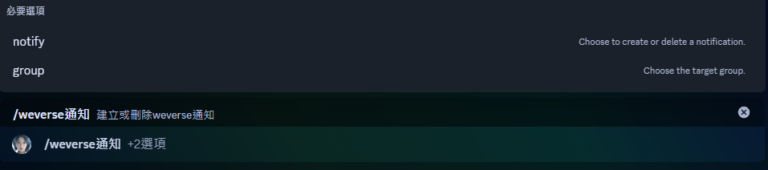

2.在notify選項選擇 `Post Notify Create`

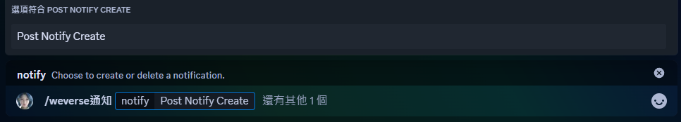

3.在group選項選擇你想要新增通知的團體

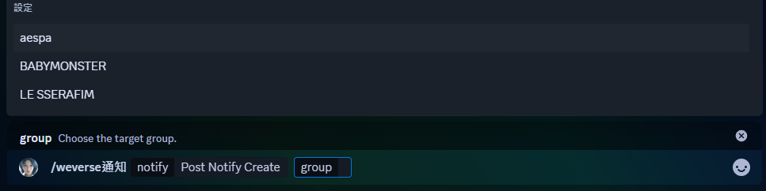

4.新增成功

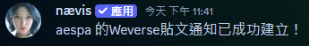
  [🔝 回到目錄](https://github.com/craz1gre0/weverse-notify-bot/blob/main/README.md#-%E7%9B%AE%E9%8C%84)

### 🗑️ 刪除weverse貼文通知

⚠️ **注意：你必須確保你擁有此伺服器的管理員權限，你才能看到這項指令。**

1.在訊息欄中輸入 `/weverse通知`

2.在notify選項選擇 `Post Notify Delete`

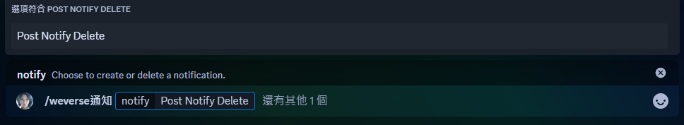

3.在group選項選擇你想要刪除通知的團體

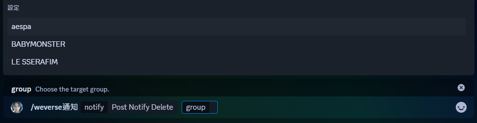

4.刪除成功

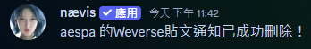
  [🔝 回到目錄](https://github.com/craz1gre0/weverse-notify-bot/blob/main/README.md#-%E7%9B%AE%E9%8C%84)

### 🖥️ 創建weverse直播通知

⚠️ **注意：你必須確保你擁有此伺服器的管理員權限，你才能看到這項指令。**

1.在訊息欄中輸入 `/weverse通知`

2.在notify選項選擇 `Live Notify Create`

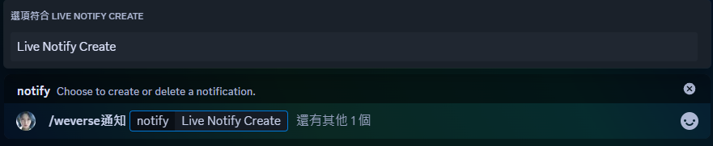

3.在group選項選擇你想要新增通知的團體

4.新增成功

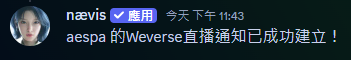
  [🔝 回到目錄](https://github.com/craz1gre0/weverse-notify-bot/blob/main/README.md#-%E7%9B%AE%E9%8C%84)

### 🗑️ 刪除weverse直播通知

⚠️ **注意：你必須確保你擁有此伺服器的管理員權限，你才能看到這項指令。**

1.在訊息欄中輸入 `/weverse通知`

2.在notify選項選擇 `Live Notify Delete`

3.在group選項選擇你想要刪除通知的團體

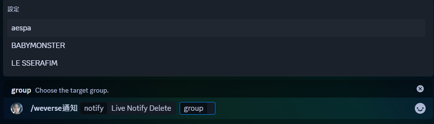

4.刪除成功

  [🔝 回到目錄](https://github.com/craz1gre0/weverse-notify-bot/blob/main/README.md#-%E7%9B%AE%E9%8C%84)

### 📄 創建IG通知

⚠️ **注意：你必須確保你擁有此伺服器的管理員權限，你才能看到這項指令。**

1.在訊息欄中輸入 `/ig通知`

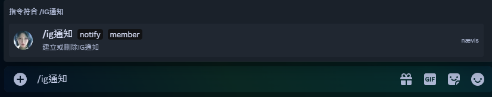

2.在notify選項選擇 `Notify Create`

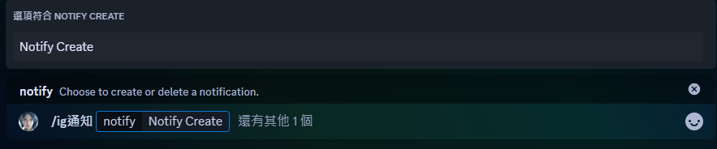

3.在member選項選擇你想要新增通知的成員

4.新增成功

  [🔝 回到目錄](https://github.com/craz1gre0/weverse-notify-bot/blob/main/README.md#-%E7%9B%AE%E9%8C%84)

### 🗑️ 刪除IG通知

⚠️ **注意：你必須確保你擁有此伺服器的管理員權限，你才能看到這項指令。**

1.在訊息欄中輸入 `/ig通知`

2.在notify選項選擇 `Notify Delete`

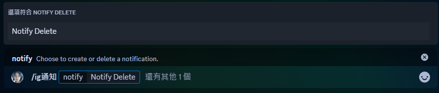

3.在member選項選擇你想要刪除通知的成員

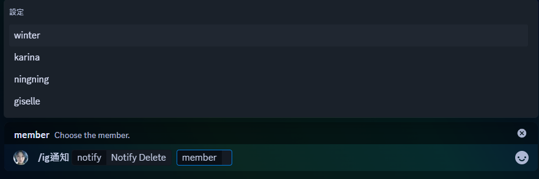

4.刪除成功

  [🔝 回到目錄](https://github.com/craz1gre0/weverse-notify-bot/blob/main/README.md#-%E7%9B%AE%E9%8C%84)

### 🔍 查看你有哪些通知(通知列表)

在訊息欄中輸入 `/notify list`
  [🔝 回到目錄](https://github.com/craz1gre0/weverse-notify-bot/blob/main/README.md#-%E7%9B%AE%E9%8C%84)

### 🔄 重置你的所有通知

⚠️ **注意：你必須確保你擁有此伺服器的管理員權限，你才能看到這項指令。**
⚠️ **注意：這將立即刪除你伺服器所有通知**

在訊息欄中輸入 `/notify reset`
  [🔝 回到目錄](https://github.com/craz1gre0/weverse-notify-bot/blob/main/README.md#-%E7%9B%AE%E9%8C%84)

### 📶 查看連線狀態

在訊息欄中輸入 `/ping`
  [🔝 回到目錄](https://github.com/craz1gre0/weverse-notify-bot/blob/main/README.md#-%E7%9B%AE%E9%8C%84)

### 💬 給我建議與回饋

在訊息欄中輸入 `/feedback [回饋與建議]`

⚠️ **注意 : 有任何問題請直接使用此指令，我會去私訊您**

  [🔝 回到目錄](https://github.com/craz1gre0/weverse-notify-bot/blob/main/README.md#-%E7%9B%AE%E9%8C%84)

## 📜 服務條款

- 我的機器人遵循[開發人員服務條款](https://discord.com/developers/docs/policies-and-agreements/developer-terms-of-service)。 
- 我們提供weverse貼文的通知。 
- 我們僅存取伺服器id,文字頻道id,你的語言，這些是必要的資料，用來發送訊息和翻譯。 
- 您永遠不應該發送垃圾郵件命令或濫用機器人。你應該向機器人的所有者報告錯誤。 
- 如果您濫用或垃圾郵件或垃圾談論我的機器人或其他機器人，您將被阻止。 
- 您可以建議我們應該為機器人添加哪些功能。 
- 感謝您使用我的機器人。 

  [🔝 回到目錄](https://github.com/craz1gre0/weverse-notify-bot/blob/main/README.md#-%E7%9B%AE%E9%8C%84)

## ⚠️ 免責聲明

1. **非官方專案**
    本機器人為個人開發的非官方專案，與 Weverse、SM 或其母公司無任何關聯或合作，也未獲得其授權或認可。

2. **責任範圍**
   - 本機器人旨在根據公開可訪問的資訊提供 Weverse 貼文的通知服務。
   - 我們將盡力確保通知的準確性和及時性，但不保證服務的不中斷或完全無誤。
   - 因使用本機器人而導致的任何損失、問題或糾紛，開發者概不負責。
     
3. **使用條款**
   - 本機器人僅供個人使用，嚴禁用於商業用途。
   - 使用者須遵守 Weverse 的使用條款，並自行承擔相關行為責任。

4. **版權與商標**
    Weverse 和 SM 及其相關商標、標誌、內容均為 HYBE Corporation 所有。本機器人不主張對其內容的所有權，也無意侵犯相關權利。

使用本機器人即表示您同意以上條款，並了解使用風險由您自行承擔。
  [🔝 回到目錄](https://github.com/craz1gre0/weverse-notify-bot/blob/main/README.md#-%E7%9B%AE%E9%8C%84)
