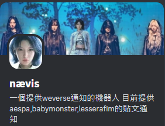

## :books: 目錄  
1. [:sparkles: 簡介](#功能)  
2. [:tools: 使用方法](#使用方法)  
   - [:pencil: 創建通知](https://github.com/craz1gre0/weverse-notify-bot/blob/main/README.md#%E5%89%B5%E5%BB%BA%E9%80%9A%E7%9F%A5)  
   - [:wastebasket: 刪除通知](https://github.com/craz1gre0/weverse-notify-bot/blob/main/README.md#%E5%88%AA%E9%99%A4%E9%80%9A%E7%9F%A5)  
3. [:scroll: 服務條款](#服務條款)  
4. [:warning: 免責聲明](https://github.com/craz1gre0/weverse-notify-bot/blob/main/README.md#-%E5%85%8D%E8%B2%AC%E8%81%B2%E6%98%8E)
## 簡介

這是一個Discord Bot，提供WEVERSE的貼文通知。

我們提供所有語言，因為會根據你的語言進行翻譯。

## 使用方法
### 創建通知
#### 步驟 1：邀請機器人到你的伺服器

機器人存活的必要權限: 
>添加反應(Add Reactions) 添加文件(Attach Files) 嵌入連結(Embed Links) 閱讀歷史訊息(Read Message History) 發送訊息(Send Messages) 使用外部表情符號(Use External Emojis) 使用斜槓指令(Use Slash Commands) 查看頻道(View Channels)

[邀請機器人連結](https://discord.com/oauth2/authorize?client_id=1314971413769359370&permissions=2147863616&integration_type=0&scope=bot)

#### 步驟 2：輸入指令

⚠️ **注意：你必須確保你擁有此伺服器的管理員權限，你才能看到這項指令。**

1.在訊息欄中輸入 /weverse

2.在notify選項選擇"create notify"

3.在group選項選擇你想要新增通知的團體

4.新增成功

### 刪除通知
#### 步驟 1：確保機器人在你的伺服器

機器人存活的必要權限: 
>添加反應(Add Reactions) 添加文件(Attach Files) 嵌入連結(Embed Links) 閱讀歷史訊息(Read Message History) 發送訊息(Send Messages) 使用外部表情符號(Use External Emojis) 使用斜槓指令(Use Slash Commands) 查看頻道(View Channels)

[邀請機器人連結](https://discord.com/oauth2/authorize?client_id=1314971413769359370&permissions=2147863616&integration_type=0&scope=bot)

#### 步驟 2：輸入指令

⚠️ **注意：你必須確保你擁有此伺服器的管理員權限，你才能看到這項指令。**

1.在訊息欄中輸入 /weverse

2.在notify選項選擇"delete notify"

3.在group選項選擇你想要刪除通知的團體

4.刪除成功

## 服務條款

我的機器人遵循[開發人員服務條款](https://discord.com/developers/docs/policies-and-agreements/developer-terms-of-service)。 
我們提供weverse貼文的通知。 
我們僅存取伺服器id,文字頻道id,你的語言，這些是必要的資料，用來發送訊息和翻譯。 
您永遠不應該發送垃圾郵件命令或濫用機器人。你應該向機器人的所有者報告錯誤。 
如果您濫用或垃圾郵件或垃圾談論我的機器人或其他機器人，您將被阻止。 
您可以建議我們應該為機器人添加哪些功能。 
感謝您使用我的機器人。 

有任何問題歡迎你聯繫我們 steven951109@gmail.com

## 📜 免責聲明

1. **非官方專案**
    本機器人為個人開發的非官方專案，與 Weverse 或其母公司無任何關聯或合作，也未獲得其授權或認可。

2. **責任範圍**
   - 本機器人旨在根據公開可訪問的資訊提供 Weverse 貼文的通知服務。
   - 我們將盡力確保通知的準確性和及時性，但不保證服務的不中斷或完全無誤。
   - 因使用本機器人而導致的任何損失、問題或糾紛，開發者概不負責。
     
3. **使用條款**
   - 本機器人僅供個人使用，嚴禁用於商業用途。
   - 使用者須遵守 Weverse 的使用條款，並自行承擔相關行為責任。

4. **版權與商標**
    Weverse 及其相關商標、標誌、內容均為 HYBE Corporation 所有。本機器人不主張對其內容的所有權，也無意侵犯相關權利。

使用本機器人即表示您同意以上條款，並了解使用風險由您自行承擔。
