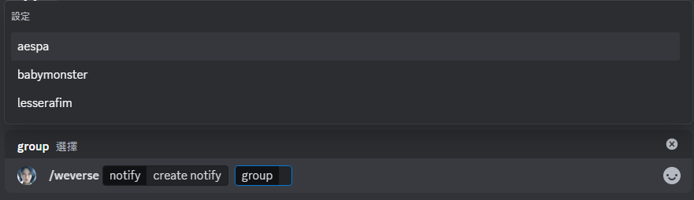

## 📚 Menu
1. [✨ Introduction](https://github.com/craz1gre0/weverse-notify-bot/blob/main/README.md#-introduction)  
2. [🛠️ Usage](https://github.com/craz1gre0/weverse-notify-bot/blob/main/README.md#%EF%B8%8F-usage)  
   - [📝 Create Notification](https://github.com/craz1gre0/weverse-notify-bot/blob/main/README.md#-create-notification)  
   - [🗑️ Delete Notification](https://github.com/craz1gre0/weverse-notify-bot/blob/main/README.md#%EF%B8%8F-delete-notification)  
3. [📜 Terms of Service](https://github.com/craz1gre0/weverse-notify-bot/blob/main/README.md#-terms-of-service)  
4. [⚠️ Disclaimer](https://github.com/craz1gre0/weverse-notify-bot/blob/main/README.md#%EF%B8%8F-disclaimer)

## ✨ Introduction

This is a Discord Bot that provides notifications for Weverse posts.

We offer support for all languages, as notifications will be translated based on your language.
  [🔝 Back to Table of Contents](https://github.com/craz1gre0/weverse-notify-bot/blob/main/README.md#-%E7%9B%AE%E9%8C%84)

## 🛠️ Usage
### 📝 Create Notification
#### Step 1: Invite the Bot to Your Server

Required bot permissions: 
>Add Reactions Attach Files Embed Links Read Message History Send Messages Use External Emojis Use Slash Commands View Channels

[Invite the Bot Link](https://discord.com/oauth2/authorize?client_id=1314971413769359370&permissions=2147863616&integration_type=0&scope=bot)

#### Step 2: Enter the Command

⚠️ **Note: You must have admin permissions on the server to see this command.**

1. Type `/weverse` in the message bar.

2. Choose "create notify" in the "notify" option.

3. Select the group you want to create notifications for.

4. Successfully created the notification.

  [🔝 Back to Table of Contents](https://github.com/craz1gre0/weverse-notify-bot/blob/main/README.md#-%E7%9B%AE%E9%8C%84)

### 🗑️ Delete Notification
#### Step 1: Ensure the Bot is in Your Server

Required bot permissions: 
>Add Reactions Attach Files Embed Links Read Message History Send Messages Use External Emojis Use Slash Commands View Channels

[Invite the Bot Link](https://discord.com/oauth2/authorize?client_id=1314971413769359370&permissions=2147863616&integration_type=0&scope=bot)

#### Step 2: Enter the Command

⚠️ **Note: You must have admin permissions on the server to see this command.**

1. Type `/weverse` in the message bar.

2. Choose "delete notify" in the "notify" option.

3. Select the group for which you want to delete notifications.

4. Successfully deleted the notification.

  [🔝 Back to Table of Contents](https://github.com/craz1gre0/weverse-notify-bot/blob/main/README.md#-%E7%9B%AE%E9%8C%84)

## 📜 Terms of Service

My bot follows [Developer Terms of Service](https://discord.com/developers/docs/policies-and-agreements/developer-terms-of-service). 
We provide notifications for Weverse posts. 
We only collect the server ID, text channel ID, and your language, which are necessary to send messages and perform translations. 
You should never spam commands or abuse the bot. Please report any bugs to the bot's owner. 
If you abuse the bot or send spam, you will be blocked. 
You may suggest features to add to the bot. 
Thank you for using my bot. 

If you have any questions, feel free to contact us at steven951109@gmail.com
  [🔝 Back to Table of Contents](https://github.com/craz1gre0/weverse-notify-bot/blob/main/README.md#-%E7%9B%AE%E9%8C%84)

## ⚠️ Disclaimer

1. **Unofficial Project**  
   This bot is an unofficial project developed by an individual and is not affiliated with or endorsed by Weverse or its parent company. It has not been authorized or recognized by them.

2. **Liability Scope**  
   - This bot provides notification services for Weverse posts based on publicly accessible information.  
   - We strive to ensure the accuracy and timeliness of the notifications, but we do not guarantee uninterrupted or error-free service.  
   - The developer is not responsible for any losses, issues, or disputes arising from the use of this bot.

3. **Usage Terms**  
   - This bot is for personal use only and may not be used for commercial purposes.  
   - Users must comply with Weverse's terms of service and are responsible for their actions.

4. **Copyright and Trademarks**  
   Weverse and its related trademarks, logos, and content are owned by HYBE Corporation. This bot does not claim ownership of its content and does not intend to infringe on any related rights.

By using this bot, you agree to the above terms and understand that the use of the service is at your own risk.
  [🔝 Back to Table of Contents](https://github.com/craz1gre0/weverse-notify-bot/blob/main/README.md#-%E7%9B%AE%E9%8C%84)
